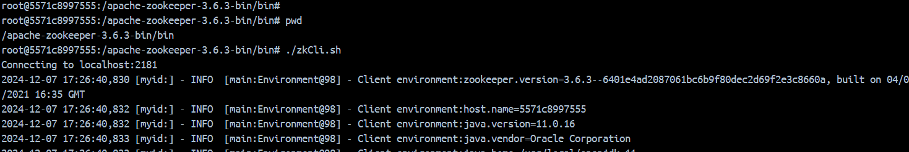
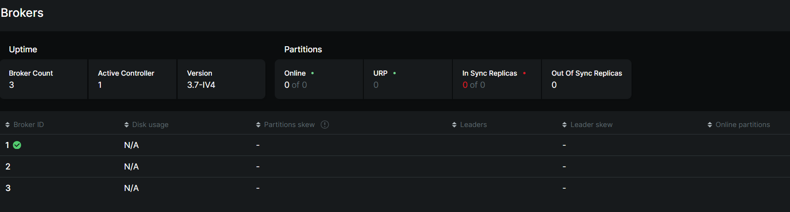
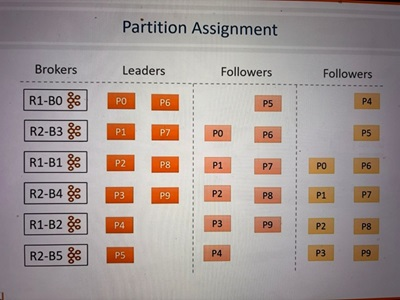

# Kafka Cluster Architecture

## Overview

In a development environment, Kafka starts with a single broker, but in production, a cluster of 3 or more brokers is preferred. As the workload grows, Kafka clusters can scale to hundreds of brokers. This scalability brings questions about how Kafka manages its cluster members and administrative tasks without a master node.

## Key Concepts:

1. Masterless Architecture:
    - Kafka does not follow the traditional master-slave architecture. Instead, it uses `Zookeeper to manage cluster membership`, handle broker failures, and coordinate the cluster's operational tasks.

2. Cluster Membership:
    - Kafka brokers are assigned unique broker IDs configured in their setup files.

    - Zookeeper maintains the list of active brokers by creating ephemeral nodes for each broker under the path `/brokers/ids`. These nodes remain as long as the broker is active and connected to Zookeeper.

        

        Access the Zookeeper CLI inside the Zookeeper container, navigate to the following directory `/apache-zookeeper-3.6.3-bin/bin` and execute the command `zkCli.sh`. This will launch the Zookeeper CLI interface for managing and interacting with Zookeeper services.

        

        From the image, we can see that Zookeeper is successfully tracking and displaying all three active Kafka brokers currently running.  [ Docker-Compose configuration file](../StorageArchitecture/MultiNodeKafka_Docker.yml) used to spin up this multi-node Kafka cluster.

    - When a broker disconnects or crashes, Zookeeper removes its corresponding ephemeral node, marking the broker as inactive.

3. Controller Role:

    - Kafka clusters require `a controller,a broker with additional responsibilities for managing cluster-level administrative tasks`, i.e monitoring list of active brokers, reassigning work when active broker leavs the cluster.

    - The controller ensures that when a broker fails, its responsibilities (like managing partitions) are reassigned to another active broker.

    - The controller is not a dedicated broker but a regular broker elected to handle extra tasks. Only one broker can act as a controller at any time in a Kafka cluster.

        

        From the Zookeeper CLI interface, we can observe that in the current setup of the multi-node Kafka cluster, brokerId-1 has been elected as the controller. This status can also be cross-verified by checking the controller information within the Kafka-UI dashboard. Both interfaces confirm that brokerId-1 is currently managing the cluster operations. 

        
    

## Controller Election Process:
- The first broker that starts up becomes the controller by creating an ephemeral controller node in Zookeeper.
- Other brokers that start after the controller try to create this node but receive an error since the controller node already exists.
- If the controller crashes, its ephemeral node in Zookeeper is removed, and the other brokers try to become the controller by creating the node again. Only one broker succeeds in becoming the new controller.

## Broker Failures and Reassignment:
- When a broker goes offline, the controller detects it through Zookeeper and reassigns its responsibilities to other active brokers autometically.

- If a broker comes back online after losing its controller status, it simply rejoins as a regular broker. It does not regain controller status unless a re-election is triggered.

## Example Setup and Demonstration:
- As we see earlier brokerId-1 is the current contoller. Now  stop the controller broker to simulate a failure and observe the election of a new controller. 

    

    From the above screenshot, we can confirm that brokerId-1 has been stopped, leading to brokerId-2 taking over as the new controller for the Kafka cluster. This behavior aligns with Kafka’s election mechanism, where a new controller is automatically selected when the previous one fails. We can also validate this change visually in the Kafka-UI,

    

- Now, restart the broker that was stopped earlier. After the broker has restarted, verify the current controller again using the Zookeeper CLI.

    

    From the above picture, we can confirm that after brokerId-1 was brought back online, but the controller did not revert to brokerId-1. BrokerId-2 continued to serve as the controller, demonstrating Kafka's mechanism where a new controller remains in place even when the previous one rejoins the cluster. This behavior is also reflected in Kafka-UI

    

## Partition Allocation in Kafka:

1. Self-contained Partitions:
    - Each partition is a self-contained unit, storing its segment files, indexes, and logs in its own directory. This design allows Kafka to distribute partitions across brokers in the cluster.

2. Kafka Clusters:
    - A Kafka cluster consists of multiple brokers. For large-scale production environments, brokers are often distributed across multiple racks for better reliability and fault tolerance.

## Partition Assignment in the Cluster:

To ensure load balancing and fault tolerance, Kafka follows a specific process when allocating partitions to brokers. Let's explore this step by step:

1. Replication and Distribution Goals:

    - **Even Distribution:** Kafka aims to distribute partitions evenly across brokers to balance the load.

    - **Fault Tolerance:** Duplicate copies (replicas) of partitions should be placed on different brokers and even across different racks to ensure high availability.

2. Leader and Follower Assignments:

    - **Leaders:** 
        - Kafka assigns leader partitions to brokers first. The leader is responsible for handling all requests from producers (writing data) and consumers (reading data). 
        - It ensures the data is replicated to its follower brokers.

    - **Followers:**
        - Kafka then assigns follower replicas, ensuring they are placed on different brokers to maintain redundancy and fault tolerance.
        - Follower brokers are responsible for replicating data from the leader to stay in sync. They do not handle direct requests from producers or consumers but can take over as leaders if the current leader fails.

3. Partition Allocation Strategy:

    - Kafka creates an ordered list of brokers and assigns leader partitions using a round-robin approach first and then follower partitions. For example, if you create a topic with 10 partitions and a replication factor of 3, Kafka will have 30 replicas to distribute across brokers.

4. Example:

    - In a 6-broker cluster with 10 partitions and a replication factor of 3, Kafka starts by assigning leader partitions to brokers in a round-robin manner. Once all leaders are assigned, follower partitions are distributed to other brokers in the cluster, ensuring replicas are not on the same broker. The distribution looks like below -- 

        

        Here R1, R2 are the racks where the brokers are present and P0 to P9 are the 10 partitions and each partitions is replicated 3 times as we define the replication factor as 3. In this example, all brokers in the Kafka cluster act as both leader and follower nodes. Each broker handles the leader partition for some topics while serving as a follower for others. 

## Producer Flow

- The producer starts by connecting to any broker in the Kafka cluster.

- The producer sends a metadata request to the broker. This request asks for information about the topic and its partitions (leader partitions).

- All Kafka brokers can respond to the metadata request. The response contains the metadata of the topic, specifically a list of leader partitions and their corresponding broker addresses.

- The producer selects the partition leader (from the metadata) where the message needs to be sent.

- The producer sends the message directly to the leader broker of the chosen partition.

- The leader broker receives the message, stores it in the appropriate partition, and sends back an acknowledgment to the producer.

## Consumer Flow

- The consumer connects to any broker in the Kafka cluster to request data.

- Similar to the producer, the consumer requests metadata, which includes information about the leader for each partition.

- The consumer queries the metadata to identify which broker is the leader for the partition they wish to read from.

- The consumer connects directly to the leader broker of the partition.

- The leader broker responds with the message stored in its partition (starting from the consumer's last read offset).

- The consumer consumes the data from the leader broker and can continue to read from it in the future.

## Fault Tolerance in Kafka:
Fault tolerance is crucial for Kafka, and it is achieved through replication and careful placement of replicas across brokers and racks.

1. Replica Distribution:

    - By ensuring that replicas are distributed across different brokers and racks, Kafka guarantees that if a broker or rack goes down, the system will still have at least one active replica to serve requests.

2. In-Sync Replicas (ISR):

    - Kafka maintains a list of In-Sync Replicas (ISR), which are the replicas that are up-to-date with the leader. If a follower replica falls too far behind, it is removed from the ISR list until it catches up.

## In-Sync Replica (ISR) List:

In Kafka, the ISR list is critical for maintaining data consistency and ensuring that Kafka clusters are fault-tolerant. The ISR consists of all the replicas (followers) of a partition that are fully synchronized with the leader partition.

### Maintaining the ISR List
The ISR list is maintained by the **leader broker** and persisted in the zookerper. If a follower `falls too far behind`, it is temporarily removed from the ISR list.

The ISR list is crucial because it tracks the followers that are fully synchronized with the leader. These replicas are prime candidates to become the leader if the current leader fails. Therefore, maintaining an accurate ISR list ensures the cluster's fault tolerance and data consistency by ensuring that only up-to-date replicas can take over leadership responsibilities and no data is lost.

### Common Reasons Followers Fall Behind
1. **Network Congestion:** Poor network performance can delay the replication process, causing the follower to lag behind the leader.
2. **Broker Failures:** If a follower broker crashes, all the replicas it maintains will lag until the broker is restarted.

### How the ISR List Works
1. Follower Requests: A follower connects to the leader and requests messages starting from a particular offset (e.g., offset 0). The leader sends all available messages, and the follower processes them.
2. Offset Check: By checking the last offset requested by the follower, the leader determines how up-to-date the follower is.
3. Dynamically Updating the ISR: The ISR list is dynamic. Followers that are in sync (within a set time) are added to the list, while those `falling too far behind` are removed.

### Key Concept: "falling too far behind"
Kafka allows followers to be a bit behind the leader due to network delays or processing time. The default tolerance is 10 seconds. If a follower hasn’t requested recent messages in the last 10 seconds, it will be removed from the ISR list.

### Potential issue with the ISR
A potential issue with the ISR list arises when all followers lag behind the leader. If this happens, the ISR list becomes empty. If the leader crashes, we need to choose a new leader, but we might lose the messages that were only stored in the leader and not replicated yet.

To address this, two concepts are introduced:
1. Committed vs  Uncommitted Messages
2. Minimum In-Sync Replicas Configuration

### Committed vs. Uncommitted Messages:

1. Committed Messages:

    - A message is considered committed once it has been replicated to all replicas in the ISR list. Committed messages are durable and cannot be lost unless all replicas fail.

2. Uncommitted Messages:

    - Messages that have not been replicated to all ISR members are uncommitted. If the leader fails, these messages may be lost, but producers can resend them if they don't receive an acknowledgment.

### Minimum ISR configuration

- **Problem:** Data Loss Risk Due to Insufficient In-Sync Replicas
    - The data in Kafka is considered committed when it is successfully replicated across all ISR. Let's assume a topic has three replicas, and all three are in the ISR, meaning they are up to date. However, if two of the replicas fail and are removed from the ISR, the only remaining in-sync replica will be the leader itself.

        In this scenario, although the topic is configured with three replicas, only the leader remains in sync. Kafka will continue to write data, considering it "committed," even though it only exists in one replica (the leader). This presents a data consistency risk: if the leader also fails before the other replicas are restored, data loss can occur since no other replica has the most recent data.

- **Solution:** 
    - To protect data from loss, Kafka allows configuring the minimum number of in-sync replicas(`min.insync.replicas`). This configuration ensures that data is considered committed only when it has been written to a minimum number of ISR replicas (e.g., at least 2 out of 3 replicas).

        If the number of in-sync replicas falls below the minimum, the broker refuses to accept new write requests to prevent data loss, making the partition read-only.

- Example
    - Configuration 
        - 4 Replicas (1 Leader + 3 Followers)
        - Minimum ISR = 2

    In this setup, at least two replicas must be in sync for the partition to accept write requests. If two replicas are out of sync at any point of time, new writes are halted until atleast one more replica catches up.

### Handling ISR Failures
When followers fail to stay in sync or the leader itself crashes:

- **Election of a New Leader:** Kafka automatically selects a new leader from the remaining in-sync followers.
- **Data Loss Risk:** If there are no followers in sync (e.g., all are more than 10 seconds behind), uncommitted data (data not replicated across all followers) may be lost if the leader crashes.