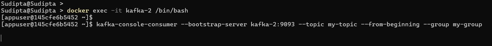

# Kafka Consumers Group with MultiNodeSetup

We will create a Kafka topic with 3 partitions, and start two consumers within the same group. Both consumers will read data from the same Kafka topic, sharing the workload. We will also use a producer to send data to the topic and observe how the consumers work.

## Prerequisites
To set up a multi-container Kafka cluster, follow the instructions in the [MultiNodeKafka Setup.](../MultiNodeKafka/README.md)

## Step 1: Create a Kafka Topic with 3 Partitions
Create a Kafka topic named `my-topic` with 3 partitions and a replication factor of 1.
```bash
kafka-topics --create --topic my-topic --bootstrap-server kafka-1:9092 --partitions 3 --replication-factor 1
```


## Step 2: Start Consumer Group to Listen to the Topic
Login to one of the Kafka nodes (e.g., `kafka-2`) and create a consumer group named `my-group` that listens to the `my-topic` topic.

```bash
kafka-console-consumer --bootstrap-server kafka-2:9093 --topic my-topic --from-beginning --group my-group
```


Now, login to another Kafka node (e.g., `kafka-3`) and run the same command to allow the second consumer to join the same group.
```bash
kafka-console-consumer --bootstrap-server kafka-3:9094 --topic my-topic --from-beginning --group my-group
```


At this point, you have a Kafka cluster with 3 partitions and a consumer group containing two consumers ready to read data from the topic.

## Step 3: Start a Producer and Send Data to the Topic

Transfer the data file [sample1.csv](../Data/sample1.csv) to `kafka-1`, which will be used as the producer. Run the following command to copy the file:
```bash
docker cp sample1.csv kafka-1:/usr/bin
```

Now, start the producer to send the data from `sample1.csv` to the `my-topic` topic:
```bash
cd /usr/bin && kafka-console-producer --topic my-topic --bootstrap-server kafka-1:9092 < sample1.csv
```

## Step 4: Verify Consumer Output
After running the producer, you can see that:

- `kafka-2` consumed 658 messages.
- `kafka-3` consumed 1249 messages.


This indicates that the two consumers are working together to consume the data from the partitions.

## Kafka Log Directory
Kafka stores partition data in its log directory. The log directory is typically located at:
```bash
/var/lib/kafka/data
```
Within this directory, you will find partitions for the `my-topic` topic:
- `my-topic-0`
- `my-topic-1`
- `my-topic-2`

Each of these represents a partition and is managed by separate kafka brokers.

## Log Files
Inside each partition folder, Kafka stores data files named `00000000000000000000.log`. These files contain the actual records for each partition.

You can use the following command to dump the log file contents:
```bash
kafka-dump-log --files 00000000000000000000.log
```

## Partition Distribution and Consumer Assignment
After running the producer, we observe the following record distribution across the partitions:

- **Partition-0** contains 585 records.

    
- **Partition-1** contains 664 records.

    
- **Partition-2** contains 658 records.

    

The total number of records matches the number of entries in `sample1.csv`, confirming that the data has been successfully distributed across the partitions.

As we have already seen that 

- `kafka-2` consumed 658 messages.
- `kafka-3` consumed 1249 messages.

we can deduce the following broker-to-partition assignment:

- Kafka-2 is assigned to Partition-2.
- Kafka-3 is assigned to Partition-0 and Partition-1.

So we understand in a Kafka cluster, data is stored in topic partitions. Each partition is handled by a separate broker, and each broker manages its own partition as a storage directory. This ensures that data is distributed across multiple brokers, 