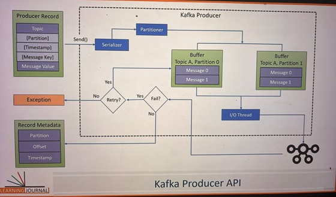

# Kafka Producer

These exists an example of an existing Kafka Producer implementation [Here](../StorageArchitecture/produceData.py)

## Kafka Producer Workflow Overview
- Set the configuration for the producer.
- Create the producer object.
- Send messages using the send() method.
- Close the producer after sending all messages.

In Python, we typically combine the first and second steps of creating a Kafka producer into a single action. 

##  ProducerRecord Object

- Each message must be wrapped in a ProducerRecord object.
- ProducerRecord includes:
    - **Topic Name:** Destination where the message will be sent.
    - **Message Value:** Actual content of the message.
    - **Optional fields:** 
        - Message Key
        - Target Partition
        - Message Timestamp.

- The `ProducerRecord` object is used in java. In Python, when sending messages with Kafka using the `KafkaProducer`, there is no separate `ProducerRecord` object. Instead, the `producer.send()` method directly takes the parameters.

## Serialization

- Kafka serializes the message before sending it over the network.
- Key and value must be serialized using serializers like `StringSerializer` or custom serializers (e.g., JSON, Avro).
- **Custom Serializers:** Useful for complex Java objects or other data formats.

## Partitioning in Kafka
- Every `ProducerRecord` in Kafka includes a mandatory topic name, which serves as the destination address for the data. Since Kafka topics are partitioned, the producer must also decide which partition the message should be sent to.

- There are two primary methods to specify the target partition:

    1. **Explicit Partitioning:** You can specify the partition number directly as an argument in the `ProducerRecord`. However, this is rarely used in practice.

    2. **Partitioner Class:** You can provide a custom partitioner class that determines the partition dynamically at runtime, based on a given strategy. In most cases, Kafka's **default partitioner** is sufficient and is widely used.

        ```Python
        from kafka import KafkaProducer
        from kafka.partitioner import DefaultPartitioner
        import random

        class CustomPartitioner(DefaultPartitioner):
            def __init__(self, partitions):
                super().__init__(partitions)
            
            def partition(self, key, all_partitions, available_partitions):
                if key is None:
                    # If no key is provided, use round-robin across all partitions
                    return random.choice(available_partitions)
                else:
                    # Custom logic, for example, hash-based partitioning
                    partition_value = hash(key) % len(all_partitions)
                    return all_partitions[partition_value]

        if __name__=="__main__":
            # Custom Partitioner Usage in Python
            producer = KafkaProducer(
                bootstrap_servers=['localhost:9092'],
                key_serializer=lambda k: str(k).encode('utf-8'),
                value_serializer=lambda v: str(v).encode('utf-8'),
                partitioner=CustomPartitioner  # Set the custom partitioner here
            )

            # Send messages
            producer.send('your-topic', key='my_key', value='my_value')

        ```

### Kafka's Default Partitioner

The default partitioner follows one of two strategies:

- **Hash Key Partitioning:** When a message key is provided, Kafka uses a hashing algorithm to assign a partition based on the key. This ensures that all messages with the same key are directed to the same partition, maintaining order for those keys. 

- **Round-Robin Partitioning:** If no key is provided (i.e., the key is null), Kafka distributes messages evenly across all available partitions using a round-robin method. This approach helps achieve balanced load distribution among partitions.

### Partition Considerations

- If you plan to scale the number of partitions later, be cautious because increasing the number of partitions after production can cause reallocation, and messages with the same key might get assigned to different partitions.

- To avoid this issue, it's often recommended to over-provision the number of partitions during topic creation. For example, if you need 100 partitions, you can create 125 partitions to accommodate future scaling without disrupting the partitioning strategy.

##  Message Timestamp

- Kafka provides two types of timestamps:

    1. CreateTime: 
        - The timestamp is set to the time when the message is produced by the client. This is the default behavior, making it the preferred method for real-time data pipelines where you want to maintain the time the event occurred.

        - In an e-commerce platform, when a user makes a purchase, the exact time of the transaction is crucial for real-time analytics and promotions. Using CreateTime, Kafka captures the timestamp when the purchase was made. This helps in triggering timely processes like inventory updates, fraud detection, or special offers based on the transaction time, ensuring accuracy even if there are delays in transmitting the data to Kafka.

    2. LogAppendTime:
        - The timestamp is set to the time when the message reaches the Kafka broker. This method is used when it's more important to capture when the message was recorded by Kafka, regardless of the producer's time.

        -  In a financial trading system that gathers trade data from multiple external sources, network delays can affect the arrival time of messages. Using LogAppendTime, Kafka assigns the time when it receives and logs the trade message, ensuring the order of message processing reflects the actual arrival time at Kafka. This helps maintain data consistency when events arrive out of order due to network delays.

- We cannot use both simultaneously, so when configuring our Kafka topic, we must choose one timestamping method by setting the `message.timestamp.type` property:
    - **CreateTime (0):** Retains the time the message was produced by the client.
    - **LogAppendTime (1):** Overwrites the producer's time with the broker's timestamp

## Buffering and Network Transmission
Kafka producer buffers messages before sending them to the broker. The **producer object** in Kafka includes a **partition-wise buffer** where messages that haven’t been sent to the Kafka broker are stored. This buffering system serves two main purposes:

1. **Asynchronous Sending:** When a producer sends a message using the send() method, the message is first added to the buffer and the call returns immediately, without waiting for the message to be sent to the broker. This improves performance by allowing the producer to continue processing while messages are handled in the background.

2. **Network Roundtrip Optimization:** The Kafka producer runs a background I/O thread, which takes messages from the buffer and sends them in batches to the broker. Combining multiple messages into a single batch reduces network overhead and improves throughput.

However, this buffering system has its limitations. If the buffer fills up (because messages are produced faster than they can be sent), subsequent `send()` calls may block until space is available in the buffer. If the buffer remains full for too long, a TimeoutException is thrown. To mitigate this, you can adjust the buffer.memory configuration, which controls the buffer size (default is 32MB).

### Python producer (`producer.send`)

In Python, `producer.send()` is also asynchronous. When the method is called, it logs the message in the buffer and returns without waiting for confirmation from the Kafka broker. To track whether the message has successfully reached the broker or not, callbacks or the `future.get()` method are used. If the message fails to be delivered, Kafka will automatically retry based on the configured retry policies. The retries are managed by Kafka's background I/O thread, which will attempt to resend the message as per the producer’s configuration (`retries` parameter). If all retries fail, the background thread will raise an error back to the `send()` method.


## Retries and Acknowledgement
- The producer’s background I/O thread sends the message to the broker and waits for an acknowledgment.
- If the broker fails to acknowledge, the producer retries sending the message.
- The number of retries is controlled by the retries property.
- If all retries fail, the producer returns an error.

## Producer Send Process Summary
- **ProducerRecord Creation:** The message is wrapped in a ProducerRecord with all the details.
- **Serialization:** The producer serializes the message key and value using the specified serializers.
- **Partitioning:** The partition number is determined.
- **Buffering:** The message is stored in a buffer,  grouped by partition.
- **Background I/O Thread Transmission:** The background I/O thread sends the message to the broker.
- **Acknowledgement:** The broker stores the message and sends an acknowledgment back to the producer.
- **Retries:** If the acknowledgment is not received, the message is retried. After a set number of retries, the producer will throw an error.
- **Completion:** The message is delivered or an error is thrown after retries fail.

    