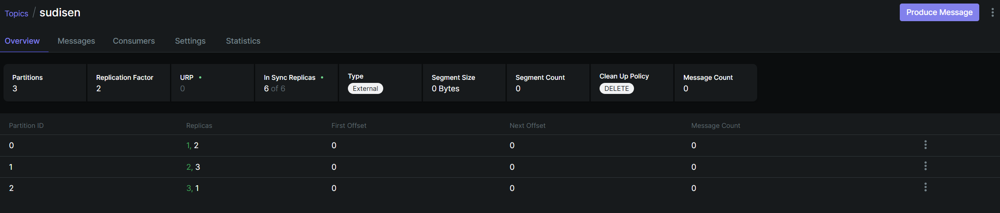

# Multi-node Kafka Cluster

The `docker-compose.yml` file provides a Docker Compose setup to spin up a **3-node Kafka cluster** running on ports 9092, 9093, and 9094 along with Kafka UI for managing and monitoring the cluster. 

## Steps to Run the Cluster:
1. Start the cluster:
    ```bash
    docker-compose up -d
    ```
2. Stop the cluster:
    ```bash
    docker-compose down
    ```

## Access Kafka UI:
Once the cluster is up, you can access the Kafka UI to monitor the cluster and manage topics:

URL: http://localhost:8090/

## Note:
- Since no topics are created initially, the Kafka UI will display "In Sync Replicas: 0 of 0" and "Online: 0 of 0".

- However, you should see brokers (kafka-1, kafka-2, and kafka-3) listed in the Brokers tab.
- We can create topics either from **Kafka UI** or by using the [Kafka-CLI](../SingleNodeKafka/topic_creation.md) or with any Kafka client. After cretion it will show up in kafka UI. Here `sudisen` is the topic name.

- After topic creation, the **Kafka UI** will display the correct information for In Sync Replicas and Online Replicas, which will no longer show as "0 of 0." 
