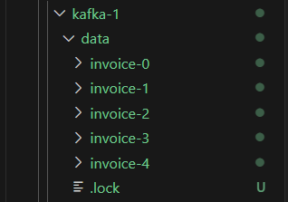

# Kafka Storage Architectural Concepts

## What is Apache Kafka?

### Basic Definition
Apache Kafka is a messaging broker.

- **Messaging Broker:** Kafka acts as an intermediary between producers (who send messages) and consumers (who receive messages).
    - **Receive Messages:**
        - Kafka brokers receive messages from producers and acknowledge the successful receipt. This ensures that the producer knows the message has been successfully received.
    - **Store Messages:**
        - Messages are stored in a log file. This storage is critical for safeguarding messages from potential loss and ensuring that consumers can consume them later, not necessarily in real-time.
    - **Deliver Messages:**
        - Kafka delivers messages to consumers upon request. This allows consumers to retrieve messages at their convenience.

### Advanced Definition
Apache Kafka is a horizontally scalable, fault-tolerant, distributed streaming platform designed for building real-time streaming data architectures.

- **Horizontally Scalable:** Kafka can handle increasing loads by adding more nodes to the cluster, allowing for seamless scaling.
- **Fault-Tolerant:** Kafka is designed to handle failures without data loss, ensuring reliability.
- **Distributed Streaming Platform:** Kafka can handle large-scale data streams distributed across multiple servers.

## Kafka Architecture Overview
We can break down its architecture into three parts:
1. Kafka Message Storage Architecture
2. Kafka Cluster Architecture
3. Work Distribution in Kafka Cluster

## Kafka Message Storage Architecture

- **Kafka Topics:**
    -  A Kafka topic is a logical name used to group messages, similar to how a database table groups data records.
    - Records are stored and published using a kafka topic. Topics are partitioned and replicated across multiple brokers.

        

- **Partitions:**
    - Mechanism to divide a topic into smaller, more manageable parts.
    - Partitions allow Kafka to scale horizontally. Each partition is an ordered, immutable sequence of records that is continually appended to. Partitions are distributed across multiple brokers.
    - **Physical Representation:** Each partition is a separate directory.

    - Example
        - `Invoice` Topic: Created with 5 partitions.
        - Result: Kafka creates 5 directories for the `invoices` topic, one for each partition.

            

        - So in the above picture we can see 5 folders are created for topic `invoice`, as we give partition 5.

- **Replication Factor:**
    - The replication factor determines how many copies of the log we want to maintain the Kafka cluster. This ensures data redundancy and fault tolerance.

    - Example
        -  If you create a Topic called `invoices` with 5 partitions and a replication factor of 3, Kafka will create 15 directories i.e each partition has a total 3 copies each so that if 2 got destroied we can retrive the data from another copies.

        ```bash
         kafka-topics --describe --topic invoice --bootstrap-server kafka-1:9092
        ```

        
        - From the above picture we can see each partitions is present in all 3 kafka broker, so total 15 directories/Replicas.

            `Number of Partition Replicas = Partitions * Replication`

- **Log Files and Segments**
    -  Messages are stored in the directories as log files.
    - **Splitting Log Files:** Instead of one large log file, Kafka splits these into smaller segments to manage them better.
        - Default Segment Size: 1 GB or 1 week of data, whichever is smaller.
        - Custom Configuration: You can configure smaller sizes (e.g., 1 MB).
    - Define segment size while topic creation, (1KB)

    ```bash
    kafka-topics.sh --create --topic invoice --bootstrap-server kafka-1:9092 --partitions 5 --replication-factor 3 --config segment.bytes=1024
    ```
    - Alter segment after topic creation
    ```bash
    kafka-configs.sh --alter --entity-type topics --entity-name invoice --add-config segment.bytes=1024 --bootstrap-server kafka-1:9092
    ```

       

    After sending random data, several log/segment files were generated in Kafka. Initially, only the files `00000000000000000000.log`, `00000000000000000000.index`, and `00000000000000000000.timestamp` were present. As more data was pushed, additional segment files were created.

    Since we set the segment size to 1KB, once the current segment reached its 1KB limit, Kafka automatically created a new segment and began writing data into it. Each of these segments corresponds to a file within a partition.    

- **Offsets:**
    - Each message within a partition has a unique identifier called an offset. These are `64-bit` integers. It is unique in a partition. The offsets are not unique accross the topic. 
        - First message has offset 0000.
        - Second message has offset 0001 and so on.
    - **Segment File Naming:** The name of the segment file includes the first offset in that segment.

        

        In the picture we can see the log file named `00000000000000000017.log` has the starting offset `17`.
-  **Locating Messages:** 
    - To find a specific message, we need to know three things:
        - Topic name
        - Partition number
        - Offset number

- **Indexing**

    - **Offset Index:**
        - Helps brokers quickly find messages based on their offsets.
        - Offset index files are segmented and stored in the partition directory along with log file segments.
    - **Time Index:**
        - Allows consumers to fetch messages based on timestamps.
        - Useful for reading events created after a specific timestamp.
        - Time index files are segmented and stored in the partition directory along with offset indexes and log file segments.

## Work Distribution in Kafka Cluster

- **Leaders:**

    - Each partition has a leader broker responsible for all reads and writes for that partition. The leader ensures data consistency and handles replication.

    - These are the main partitions created initially. For 5 partitions, Kafka will create 5 leader directories.

- **Followers:**
    - Follower brokers replicate the leader's data and take over if the leader fails, ensuring high availability.  If the replication factor is 3, Kafka will create 2 follower directories for each leader to ensure there are total 3 copies of each partition.

        ```bash
         kafka-topics --describe --topic invoice --bootstrap-server kafka-1:9092
        ```

        
    
    - From the above picture we can see the leader and replica partitions.

- **In Sync Replicas (ISRs):**
    - ISRs are replicas that are fully caught up with the leader's data. They ensure the durability of data.

- **Committed and Uncommitted Messages:**
    - Committed messages are those that have been successfully written to the leader and replicated to the ISRs. Uncommitted messages are not yet replicated and are at risk of loss if the leader fails.

##  Kafka Messages Arrangement

In databases, data access typically uses meaningful identifiers like invoice_number, customer_name, or customer_id. Kafka messages are not structured into columns, thus using partition and `offset numbers` for `identification`.

In stream processing applications, the requirement for data retrieval differs from traditional databases.

### Example:

- **Application:** Computes loyalty points for customers in real-time.
- **Requirement:** Reads all messages in sequence to calculate points based on customer_id and amount.
- **Process:** 
    -  Application connects to the broker and requests messages starting from offset 0.
    - Broker sends 10 messages.
    - Application processes these messages to compute loyalty points.
    - Application requests more messages starting from offset 10.
    - The application continues this process, requesting subsequent messages based on the last processed offset.
- **Importance of Offset**
    - Kafka allows consumers to fetch messages starting from a given offset.
    - The broker must locate messages quickly based on the offset.
    - Indexing of offset (similar to log file) helps us to find msges faster.